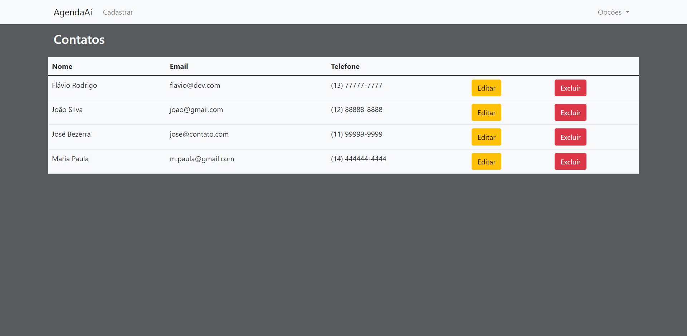

<h1 align="center">
    Agenda Aí
</h1>

<h4 align="center"> 
	🚧 AgendaAí 1.0 - em construção... 🚧
</h4>

<p align="center">
  

  

  <a href="https://github.com/HerikCosmo/agenda-ai/commits/master">
    
  </a>

  
   <a href="https://github.com/HerikCosmo/agenda-ai/stargazers">
    
  </a>
</p>


## 💻 Sobre o projeto

AgendaAí - é uma simples agenda capaz de registrar o nome, email e o telefone de seus contatos favoritos.

Projeto desenvolvido com PHP, utilizando a estrutura MVC.

## 🎨 Layout


### Web

<p align="center" style="display: flex; align-items: flex-start; justify-content: center;">
  
</p>

## 🛠 Tecnologias

As seguintes ferramentas foram usadas na construção do projeto:

- [PHP][php]
- [Composer][composer]
- [Bootstrap][bootstrap]


## 🚀 Como executar o projeto

### Pré-requisitos
- GIT instalado
- PHP 7.4.27 instalado
- Composer instalado

### 🎲 Rodando a aplicação

```bash
# Clone este repositório
$ git clone https://github.com/HerikCosmo/agenda-ai

# Acesse a pasta do projeto no terminal/cmd
$ cd agenda-ai

# Instale as dependências
$ composer i

# Execute a aplicação
$ php -S localhost:8000 -t public

# O servidor inciará na porta:8000 - acesse http://localhost:8000
```

## 📝 Licença

Este projeto esta sobe a licença MIT.

Feito por [Herik Cosmo](https://www.linkedin.com/in/herik-martins-3194b4208/)

README.md baseado em: [Ecoleta](https://github.com/tgmarinho/Ecoleta/blob/master/README.md)

[php]: https://www.php.net/
[composer]: https://getcomposer.org/
[bootstrap]: https://getbootstrap.com/
